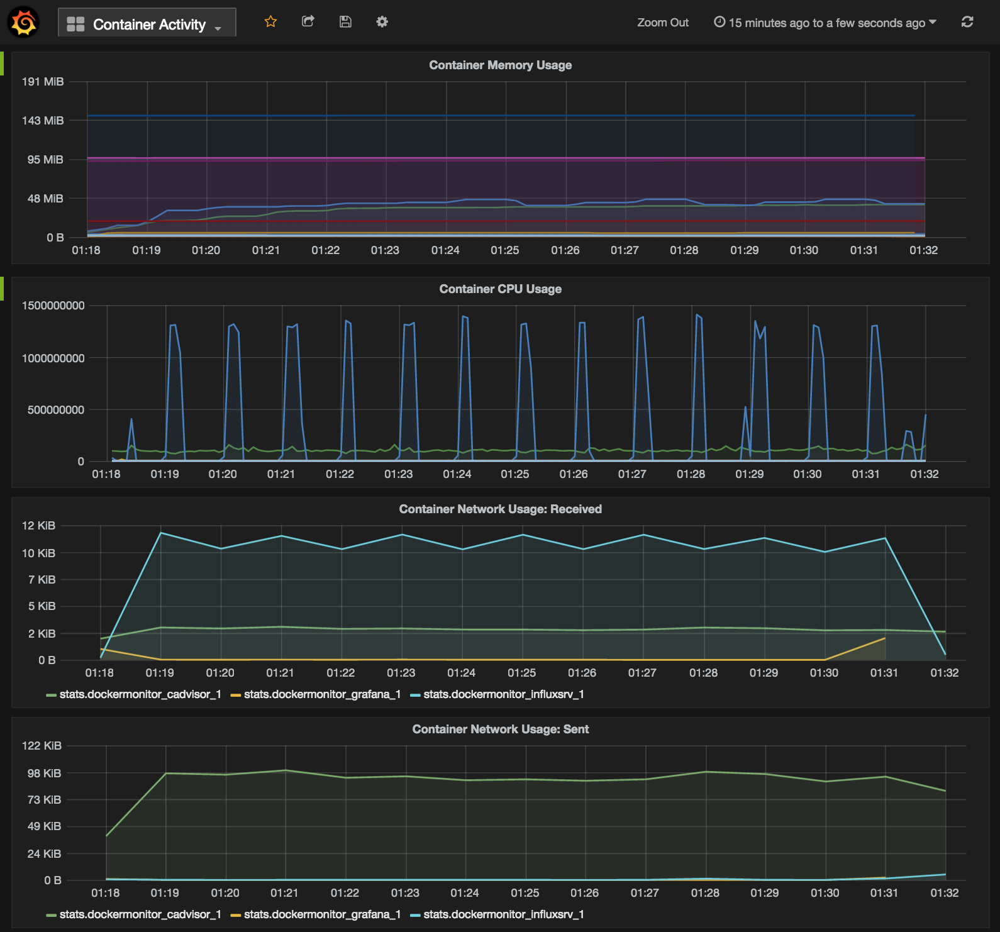
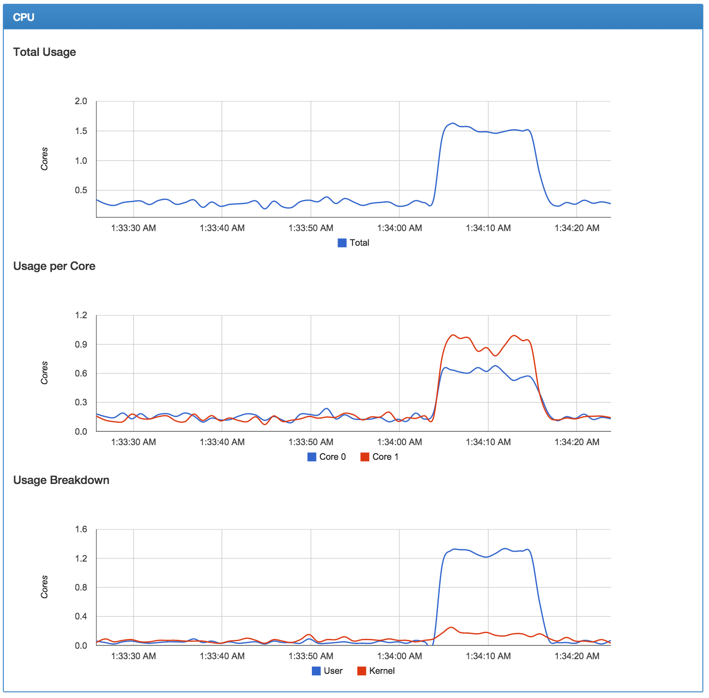
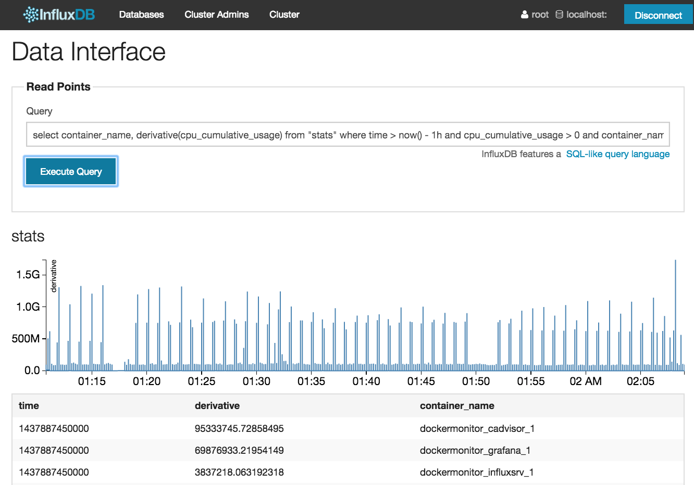

# Docker Container Monitoring

Monitor realtime and historical memory, cpu, and network usage of running Docker containers, and
share the dashboards with your team.

Run cAdvisor with InfluxDB and Grafana
--------------------------------------

Launch the [cAdvisor](https://github.com/google/cadvisor) monitoring
service with an
[InfluxDB](https://influxdb.com/docs/v0.9/introduction/overview.html)
storage backend and [Grafana](http://grafana.org/) web-based dashboard
with a simple command. Everything runs in
Docker containers, so you don't need to install anything.

[docker-compose.yml](docker-compose.yml) is a
[Docker Compose](https://docs.docker.com/compose/) definition that
starts the three services in containers and wires them together for you.

Read [docker-compose.README.md](docker-compose.README.md) for details.

Connect Grafana to InfluxDB & Share Team Dashboards
---------------------------------------------------

Once cAdvisor is writing to InfluxDB, you'll need to configure
Grafana to connect to InfluxDB, then load up your team's shared
Dashboards.

[grafana-influxdb.sh](grafana-influxdb.sh) ensures that an InfluxDB
database and user exists, that Grafana has a data store that points
to it, and any dashboards that you point to are created in Grafana.

Read [grafana-influxdb.README.md](grafana-influxdb.README.md) for details.

Try It Out!
-----------

Try out the "Container Activity" dashboard, which shows the CPU, memory,
and network activity for all of your Docker containers.

1. Start your monitoring Docker cluster. The first time you run this might
take a little while, since Composer will need to download Docker images
from the [Docker Hub](https://registry.hub.docker.com/search):

        docker-composer up

2. Wait 10 seconds, so the services have time to start.

3. Run this command, which will set up Grafana to talk with InfluxDB,
and import the [Container Activity](dashboards/Container-Activity.json)
dashboard into Grafana:

        ./grafana-influxdb.sh cadvisor ./dashboards/*.json

4. View your new Grafana dashboard at [http://localhost:3000](http://localhost:3000).

    

5. View your new cAdvisor realtime performance monitoring dashboard at
[http://localhost:9090](http://localhost:9090).

    

6. Query for specific metrics using your new InfluxDB instance at [http://localhost:8083](http://localhost:8083).

    
